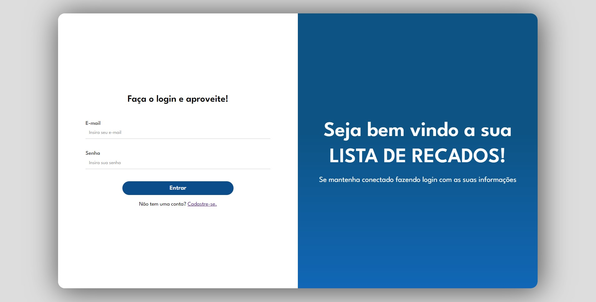
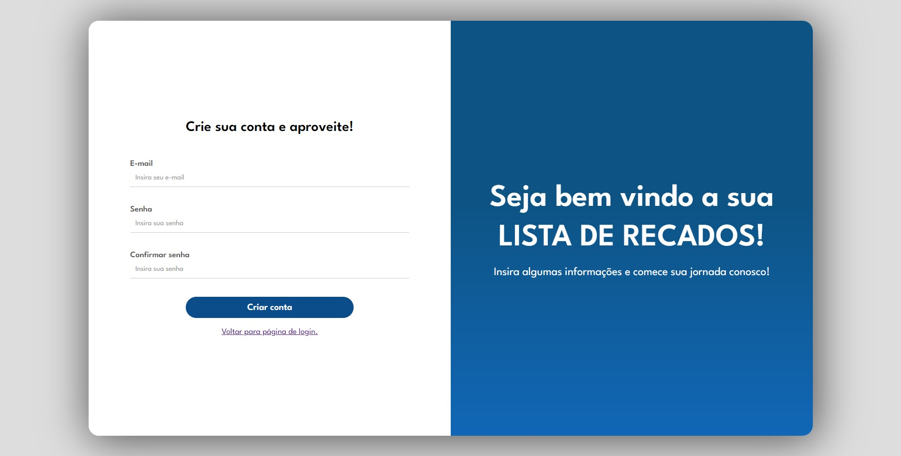
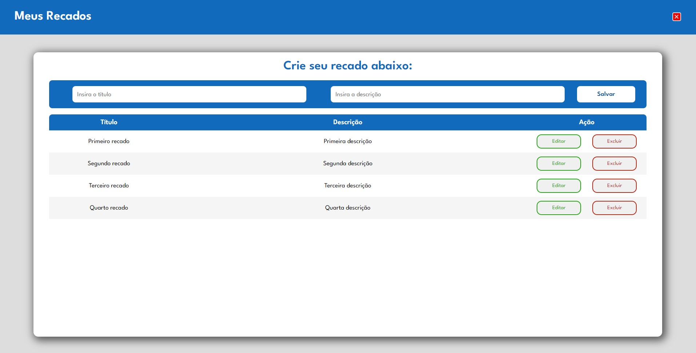

<h1 align=center>Atividade Final de Módulo | Desenvolvimento Web #01</h1>

Projeto realizado para conclusão de módulo no Programa Starter | Growdev

  
  
  

## 🚀 Tecnologias

Projeto desenvolvido com as seguintes tecnologias:

- HTML
- CSS
- JavaScript
